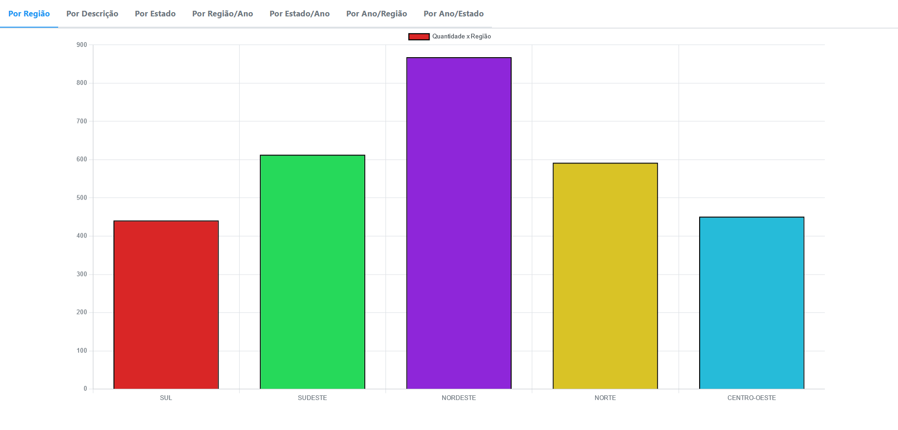
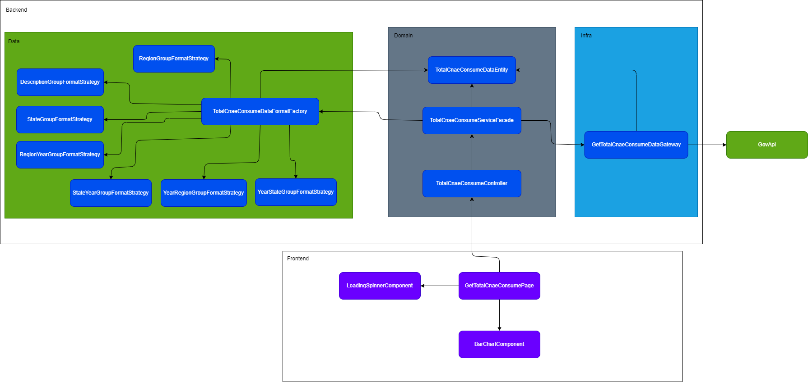

# Gáficos Laravel/Vue - Douglas Volcato



## Funcionalidade
A funcionalidade principal deste projeto é mostrar gráficos na página, utilizando os dados obtidos da API do governo.

## Tecnologias Utilizadas
- PHP
- Javascript
- Laravel
- Vue
- Primevue

## Como instalar e executar este projeto utilizando o Docker
1. Execute o seguinte comando para criar a imagem no Docker:
   ```
   docker build -t laravel-vue-charts .
   ```

2. Agora para executar o projeto, utilize o comando:
   ```
   docker run -p 8000:8000 laravel-vue-charts
   ```
   Deste modo o projeto será aberto no link http://localhost:8000

## Desenho da aplicação
